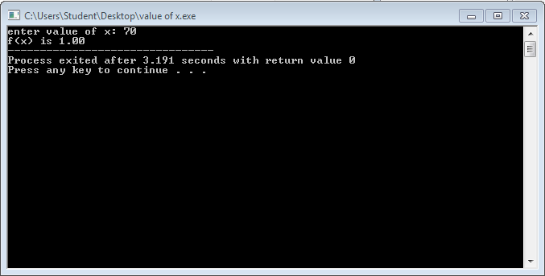
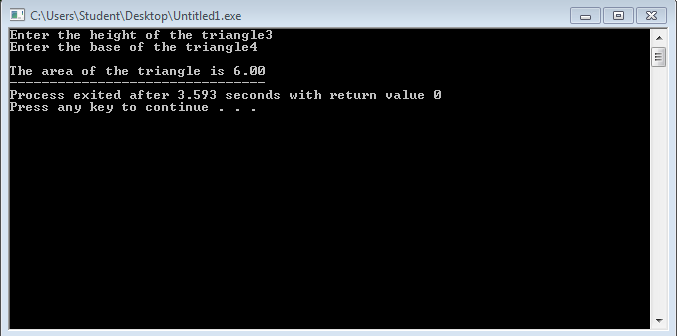

# Activity1-Salcedo


```
#include <stdio.h>
#include <conio.h>

main ()
{
     float b, fx;
     printf("enter value of x: ");
     scanf("%f",&b);
     
     fx=b/70;
     
     printf("f(x) is %.2f",fx);
     
    
     
     }
     
```


```
#include <stdio.h>
#include <conio.h>

main()
{
      float h, b, a;
      printf("Enter the height of the triangle");
      scanf("%f",&h);
      printf("Enter the base of the triangle");
      scanf("%f",&b);
      
      a= b*h/2;
      
      
      
      
      
      printf("\nThe area of the triangle is %0.2f",a);
      
      
      
     getch();
     }

```

